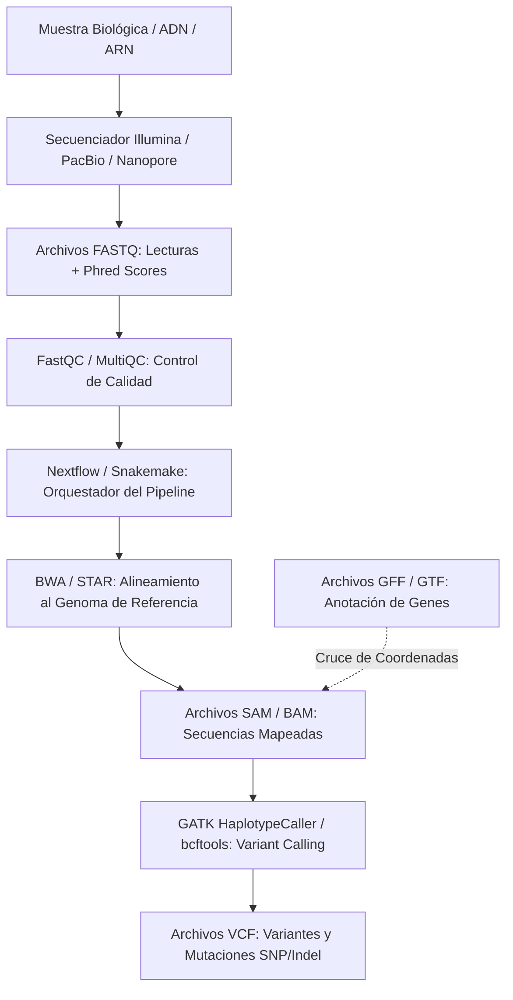

# 🧬 Glosario Maestro: Formatos, Herramientas y Pipelines NGS

> [!IMPORTANT]
> **Fuente de Verdad de Conceptos Técnicos** en Bioinformática y Secuenciación de Nueva Generación (NGS).
> Este documento centraliza las definiciones, anatomía de archivos y flujos de trabajo para repaso continuo, preparación de exámenes universitarios y entrevistas técnicas.

---

## 📑 Tabla de Contenidos
- [1. El Flujo de Datos Genómicos (Pipeline E2E)](#1-el-flujo-de-datos-genómicos-pipeline-e2e)
- [2. Formatos de Archivos Fundamentales](#2-formatos-de-archivos-fundamentales)
  - [FASTQ (Lecturas Crudas + Calidad Phred)](#fastq-lecturas-crudas--calidad-phred)
  - [FASTA (Secuencias Biológicas)](#fasta-secuencias-biológicas)
  - [SAM / BAM (Lecturas Alineadas al Genoma)](#sam--bam-lecturas-alineadas-al-genoma)
  - [VCF (Llamada de Variantes y Mutaciones)](#vcf-llamada-de-variantes-y-mutaciones)
  - [GFF / GTF (Anotación de Genes y Estructura Genómica)](#gff--gtf-anotación-de-genes-y-estructura-genómica)
- [3. Herramientas y Orquestadores de Producción](#3-herramientas-y-orquestadores-de-producción)
  - [FastQC & MultiQC (Control de Calidad)](#fastqc--multiqc-control-de-calidad)
  - [Nextflow & Snakemake (Workflow Management Systems)](#nextflow--snakemake-workflow-management-systems)
  - [Rosalind (Algoritmos y Práctica de Código)](#rosalind-algoritmos-y-práctica-de-código)

---

## 🔄 1. El Flujo de Datos Genómicos (Pipeline E2E)

En bioinformática, los datos transitan secuencialmente por formatos y herramientas específicas desde el secuenciador hasta la variante clínica:

---

## 📄 2. Formatos de Archivos Fundamentales

### FASTQ (Lecturas Crudas + Calidad Phred)
- **Qué es:** Formato estándar de salida de secuenciadores. Grupos estStrictos de 4 líneas por lectura.
- **Estructura:**
  - Línea 1: `@Header` (ID del secuenciador, flowcell, coordenadas de cluster).
  - Línea 2: Secuencia de nucleótidos (`ATCGN`).
  - Línea 3: `+` (Separador).
  - Línea 4: Caracteres ASCII Phred+33 ($Q = -10 \log_{10} P$).

### FASTA (Secuencias Biológicas)
- **Qué es:** Formato de texto simple para secuencias de ADN, ARN o proteínas (referencias genómicas, contigs).
- **Estructura:**
  - Línea 1: `>Header` (Nombre del cromosoma, contig o proteína).
  - Líneas siguientes: Cadena continua de nucleótidos o aminoácidos.

### SAM / BAM (Lecturas Alineadas al Genoma)
- **Qué es:** Contiene las lecturas del FASTQ mapeadas con coordenadas sobre un genoma de referencia.
- **Diferencia SAM vs BAM:**
  - **SAM (Sequence Alignment Map):** Texto plano legible por humanos.
  - **BAM (Binary Alignment Map):** Versión binaria comprimida e indexada para búsqueda rápida (`samtools`).

### VCF (Llamada de Variantes y Mutaciones)
- **Qué es:** Formato estándar para almacenar mutaciones y variaciones genéticas (SNPs, Indels, SVs) detectadas en un individuo.
- **Campos clave:** `CHROM`, `POS`, `ID`, `REF` (base de referencia), `ALT` (base mutada), `QUAL` (confianza Phred), `FILTER`, `INFO`, `FORMAT`, `SAMPLE`.

### GFF / GTF (Anotación de Genes y Estructura Genómica)
- **Qué es:** Formato tabulado de 9 columnas que define las coordenadas biológicas de elementos del genoma (genes, exones, intrones, promotores, UTRs).
- **Uso:** Permite saber en qué gen o región funcional cae una variante VCF o una lectura BAM.

---

## 🛠️ 3. Herramientas y Orquestadores de Producción

### FastQC & MultiQC (Control de Calidad)
- **FastQC:** Diagnostica la salud de un archivo FASTQ ($Q$-scores per base, adaptadores Illumina, contenido %GC).
- **MultiQC:** Consolida múltiples reportes de FastQC en una sola interfaz interactiva `.html`.

### Nextflow & Snakemake (Workflow Management Systems)
- **Nextflow:** Orquestador DSL2 dominante en la industria clínica y farmacéutica (comunidad `nf-core`). Ejecuta pipelines reproducibles conectando Docker, Apptainer, SLURM y Cloud AWS/GCP.
- **Snakemake:** Orquestador basado en sintaxis Python, ampliamente utilizado en investigación académica y análisis de datos genómicos.

### Rosalind (`rosalind.info`)
- **Plataforma de algoritmos:** Entorno de problemas bioinformáticos para dominar manipulación de cadenas, estructuras de datos y lógica biológica en Python.

---

*Glosario vivo. Se actualiza al incorporar nuevos formatos o herramientas durante La Campaña.*
