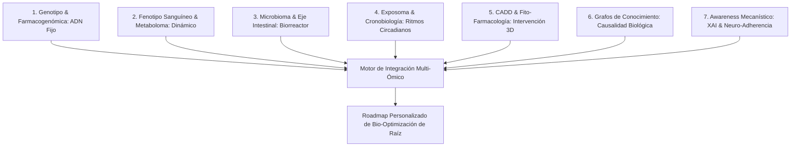

# 🧬 Medicina de Precisión Integral, Redes Alostéricas y Awareness Mecanístico

> [!IMPORTANT]
> **Documento de Arquitectura y Fundamentos de Bio-Optimización Integral**
> Centraliza los 7 pilares de la medicina de precisión, la biofísica de los ejes metabólicos interconectados y la estrategia de comunicación mecanística (XAI) para la toma de consciencia del paciente. Conecta la formación de `empleoBio` con el motor biológico de `Bull.Tech`.

---

## 📑 Tabla de Contenidos
- [1. La Filosofía Sistémica: Más Allá de la Pastilla Mágica](#1-la-filosofía-sistémica-más-allá-de-la-pastilla-mágica)
- [2. Los 7 Pilares de la Medicina de Precisión Integral](#2-los-7-pilares-de-la-medicina-de-precisión-integral)
- [3. La Red Metabólica y Alostérica: Los 4 Interruptores Maestros](#3-la-red-metabólica-y-alostérica-los-4-interruptores-maestros)
- [4. Farmacognosia Moderna, CADD & Fitoquímica](#4-farmacognosia-moderna-cadd--fitoquímica)
- [5. Estrategia de Awareness: Cómo Comunicar para Transformar Hábitos](#5-estrategia-de-awareness-cómo-comunicar-para-transformar-hábitos)
- [6. Stack Tecnológico, Algoritmos y Bases de Datos](#6-stack-tecnológico-algoritmos-y-bases-de-datos)

---

## 💡 1. La Filosofía Sistémica: Más Allá de la Pastilla Mágica

La medicina convencional reactiva (*Sick-Care*) padece de dos fallas estructurales:
1. **El desfase de traslación (*17-year Translation Gap*):** Los descubrimientos empíricos en biología de sistemas tardan casi dos décadas en convertirse en prescripción hospitalaria rutinaria.
2. **Reduccionismo Farmacológico ("Una diana, un síntoma, un fármaco"):** Trata el cuerpo como piezas estancas. Si una persona tiene glucosa alta, se le da metformina; si tiene insomnio, zolpidem; si tiene inflamación, AINEs. Esto no erradica la causa raíz, perpetúa la cronicidad y satura los citocromos de detoxificación.

### El Principio de No Moralización Biológica:
> **"En el cuerpo humano no existen moléculas, alimentos ni procesos intrínsecamente 'malos' o 'buenos'; existen vectores de afinidad bioquímica operando dentro de un contexto fisiológico, horario y dosis-dependiente."**

* **Los carbohidratos no son veneno:** En el contexto de reabastecimiento tras contracción muscular vigorosa (translocación de GLUT4 independiente de insulina), recargan el glucógeno y modulan el cortisol. A las 11 PM en sedentarismo, saturan el citrato mitocondrial y activan la lipogénesis *de novo* hepática.
* **La inflamación no es el enemigo:** Es la cascada requerida para remodelación tisular y respuesta inmune; la patología es la inflamación crónica de bajo grado que nunca se resuelve (*resolvinas/protectinas* deficientes).

---

## 🏛️ 2. Los 7 Pilares de la Medicina de Precisión Integral

Para diseñar sistemas de salud personalizados con pericia legendaria, deben parametrizarse 7 capas de información:



1. **Capa Genotípica (El Plano Fijo):** SNPs, haplotipos, citocromos (*CYP2D6, CYP2C19, CYP3A4*), enzimas de metilación (*MTHFR, COMT*) y Puntuaciones de Riesgo Poligénico (PRS).
2. **Capa Fenotípica & Sanguínea (El Estado Dinámico en Rangos Óptimos):** Marcadores medidos en rangos funcionales estrechos (hs-CRP $< 0.5\text{ mg/L}$, ApoB $< 70\text{ mg/dL}$, HOMA-IR $< 1.0$, ferritina, homocisteína), no rangos patológicos poblacionales.
3. **Capa del Microbioma & Barrera Mucosa (El Biorreactor Simbiótico):** Razón *Firmicutes/Bacteroidetes*, productores de ácidos grasos de cadena corta (butirato, propionato), permeabilidad intestinal (zonulina) y traslocación de endotoxinas (LPS).
4. **Capa del Exposoma & Cronobiología (El Ritmo Físico):** Fotobiología (exposición a fotones UV/infrarrojos), arquitectura del sueño (ondas lentas N3 y REM), variabilidad de frecuencia cardíaca (HRV) y carga de xenobióticos/metales pesados.
5. **Capa Estructural, CADD & Fitoquímica (La Precisión Molecular con IA):** Modelado conformacional 3D (Boltz-2, DiffDock, AlphaFold3) y estabilidad en solvente (OpenMM/GROMACS) para cribar fármacos, péptidos y metabolitos secundarios botánicos.
6. **Capa de Grafos de Conocimiento Biomédico (Causalidad Multiescala):** Redes biológicas dirigidas (Gene $\rightarrow$ Protein $\rightarrow$ Pathway $\rightarrow$ Metabolite $\rightarrow$ Phenotype) para evitar efectos secundarios y maximizar pleiotropía positiva.
7. **Capa de Awareness Mecanístico & Explicabilidad (La Consciencia del Paciente):** Traducir la algoritmia a explicaciones visuales de causa-efecto (XAI) para empoderar al usuario mediante entendimiento biológico real.

---

## ⚡ 3. La Red Metabólica y Alostérica: Los 4 Interruptores Maestros

```
                 EL TABLERO DE CONTROL CELULAR
  ══════════════════════════════════════════════════════════════
  1. ANABOLISMO / CATABOLISMO    : mTOR  ◄────────►  AMPK
  2. COMBUSTIBLE ENERGÉTICO      : Insulina ◄─────►  Glucagón / Cetonas
  3. SINCRONIZACIÓN TEMPORAL     : BMAL1/CLOCK ◄──►  Cortisol / Melatonina
  4. RESILIENCIA CELULAR         : Nrf2 (Hormesis) ◄► NF-κB (Inflamación)
  ══════════════════════════════════════════════════════════════
```

### A. El Interruptor mTOR vs. AMPK (Construcción vs. Limpieza)
* **mTOR (Mechanistic Target of Rapamycin):** Se activa con aminoácidos ramificados (Leucina) e insulina alta. Promueve síntesis proteica, hipertrofia muscular y proliferación. Su activación constante y sin pausas acelera la senescencia celular y bloquea la autofagia.
* **AMPK (AMP-activated Protein Kinase):** El sensor de baja energía celular (relación AMP/ATP alta). Se activa con ejercicio aeróbico (Zona 2), ayuno intermitente y compuestos bioactivos (berberina, quercetina). Activa la **autofagia** (reciclaje de mitocondrias y proteínas dañadas), la biogénesis mitocondrial vía PGC-1$\alpha$ y la $\beta$-oxidación de ácidos grasos.

### B. El Eje Insulina-Glucagón (Flexibilidad Metabólica)
* **Insulina:** Hormona anabólica de almacenamiento. Suprime la lipólisis (inhibe la Lipasa Sensible a Hormonas - HSL) y promueve el ingreso de glucosa a tejidos dependientes vía GLUT4.
* **Flexibilidad Metabólica:** La capacidad del miocito y hepatocito de conmutar instantáneamente entre oxidar glucosa (postprandial) y oxidar ácidos grasos/cuerpos cetónicos (ayuno/ejercicio). La resistencia a la insulina es el atasco crónico donde la célula no puede oxidar grasas ni gestionar glucosa eficientemente.

### C. El Eje Circadiano BMAL1/CLOCK vs. Melatonina/Cortisol
* **Ritmo Central (SCN):** Sincronizado por la luz solar en la retina matutina.
* **Osciladores Periféricos (Hígado, Páncreas, Músculo):** Sincronizados por el horario del primer y último bocado de alimento.
* **La trampa nocturna:** La melatonina nocturna interactúa con los receptores $MT_1/MT_2$ en las células beta del páncreas para **suprimir la secreción de insulina** (preparando al cuerpo para el ayuno del sueño). Comer tarde causa hiperglucemia prolongada, estrés oxidativo e interrumpe el aclaramiento glinfático cerebral en la fase de ondas lentas N3.

### D. Eje Nrf2 vs. NF-$\kappa$B (Hormesis y Adaptación)
* **Hormesis:** Estresores agudos y transitorios (ejercicio de alta intensidad, choque térmico en sauna/frío, fitonutrientes como el sulforafano del brócoli) generan especies reactivas de oxígeno (ROS) controladas que disocian Keap1 y liberan **Nrf2**, el cual viaja al núcleo y activa los Elementos de Respuesta Antioxidante (ARE: glutatión, catalasa, SOD).

---

## 🌿 4. Farmacognosia Moderna, CADD & Fitoquímica

* **La Naturaleza como Librería de Andamiajes Químicos:** Los metabolitos secundarios vegetales (polifenoles, terpenos, alcaloides) evolucionaron durante millones de años para interactuar con receptores biológicos.
* **El Enfoque Riguroso:** No caer en la falacia de "si es natural, no hace daño". Todo compuesto bioactivo tiene farmacocinética ($C_{max}, T_{max}, t_{1/2}$), interacciones con citocromos (ej. el pomelo inhibe irreversiblemente $CYP3A4$) y potencial de toxicidad hepática/renal a dosis inadecuadas.
* **IA Estructural al Servicio de la Fito-Farmacología:** Utilizar **Boltz-2** y **DiffDock** para predecir cómo un fitocompuesto (ej. curcumina, berberina, apigenina, ácido elágico) se acopla a enzimas diana y comparar su afinidad contra moléculas sintéticas de referencia.

---

## 🗣️ 5. Estrategia de Awareness: Cómo Comunicar para Transformar Hábitos

Para que el paciente tome consciencia y adopte el cambio por discernimiento, el motor debe entregar reportes bajo la estructura **Causal-Mecanística (XAI)**:

```
  ┌─────────────────────────────────────────────────────────────┐
  │ ESTRUCTURA DE REPORTE MECANÍSTICO AL PACIENTE               │
  ├─────────────────────────────────────────────────────────────┤
  │ 1. DATO OBSERVABLE : Tu biomarcador / genotipo medido       │
  │ 2. MECANISMO REAL  : La cascada bioquímica activada         │
  │ 3. CONSECUENCIA    : Por qué te sientes o rindes así        │
  │ 4. ACCIÓN PRECISA  : Qué hacer, cuándo y por qué funciona   │
  │ 5. RE-EVALUACIÓN   : Métrica observable en tu próximo test  │
  └─────────────────────────────────────────────────────────────┘
```

### Ejemplo de Comunicación Causal vs. Prescripción Dogmática:
* ❌ **Enfoque Dogmático Médico Tradicional:** *"Tiene prediabetes. Deje de comer carbohidratos por la noche y tómese esta metformina 850 mg cada 12 horas."* (Genera culpa, confusión y cero entendimiento).
* ✅ **Enfoque de Awareness Mecanístico:** *"Tu índice HOMA-IR está en 2.4 (resistencia a nivel hepático y muscular). Al caer la noche, tu cerebro produce melatonina para apagar la actividad metabólica, lo que desactiva temporalmente la capacidad de tu páncreas de producir insulina rápida. Si consumes carbohidratos densos a las 10 PM, esa glucosa no puede entrar al músculo y tu hígado la transforma en grasa visceral. Si concentras tus carbohidratos después de tu sesión de fuerza (donde tus músculos absorben glucosa directamente sin necesitar insulina), optimizarás tu energía diurna y mantendrás la autofagia activa durante la noche."*

---

## 🛠️ 6. Stack Tecnológico, Algoritmos y Bases de Datos

| Capa | Tecnologías / Librerías | Bases de Datos de Referencia |
| :--- | :--- | :--- |
| **Genotipo & Farmacogenómica** | `bcftools`, `Biopython`, parseo de Star Alleles. | **CPIC Guidelines**, **PharmGKB**, **PharmVar**. |
| **Metaboloma & Biomarcadores** | `pandas`, `scikit-learn`, `SHAP`, `lifelines`. | **HMDB**, **MetaboAnalyst**, **UK Biobank**. |
| **Quimioinformática & CADD** | `RDKit`, `OpenMM`, `GROMACS`. | **ChEMBL**, **PubChem**, **DrugBank**. |
| **Fitoquímica & Productos Naturales** | Descriptores moleculares QSAR, Morgan Fingerprints. | **COCONUT Database**, **FooDB**, **KNApSAcK**. |
| **IA Estructural & Co-folding** | **Boltz-2**, **Chai-1**, **DiffDock**, **AlphaFold3**. | **RCSB PDB**, **AlphaFold DB**. |
| **Grafos de Causalidad & XAI** | `NetworkX`, `Neo4j`, Cypher queries, DAGs causales. | **STRING-db**, **Reactome**, **KEGG**, **DisGeNET**. |

---

*Documento maestro de referencia para La Campaña, asignaturas universitarias y el ecosistema de bio-optimización Bull.Tech.*
